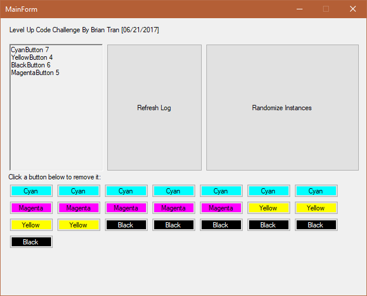

# Class Instance Tracker

By: Brian Tran

Date: 06.21.2017

## How to Run the Program

#### Requirements

- To run the Solution:
  - Microsoft Visual Studio 2015 Update 3 with .NET Framework 4.6.1

#### Option 1 (via executable):

1. Open "ClassInstanceTracker.exe" in the top-level directory.
2. The program should start running.

#### Option 2 (via solution):

1. Open solution at "ClassInstanceTracker/ClassInstanceTracker.sln".
2. Once the solution is open in Microsoft Visual Studio 2015, select "DEBUG" from the menu bar and select the "Start Debugging" option.
3. The program should start running.

## Coding Challenge

Using either C# or Java, design and implement the following:

1. A mechanism to count the number of times a set of classes have been instantiated.
2. The solution must be generic enough such that it can count instances of an arbitrary number of different classes.
3. The solution must be extensible such that defining new classes to be counted is trivially easy using standard OO principles.
4. Demonstrate the solution by instantiating a number of different classes, and then output the name of the class followed by the number of instances created.
5. Submit complete source code and sample output of running the program.  It must compile and run cleanly without errors or warnings.  Include an explanation of your design choices, any trade-offs, and potential alternative considerations.

For example, the output of such a program might look like this:

```
CountMe 5
CountMeToo 4
AndMe 12
Counted 5
```

6. For additional bonus points, consider a mechanism that does not require each class counted to inherit from a common base class.
7. For even more bonus points, in addition to the number of instances created, also display the count of the number of instances that are still alive (i.e. reachable).

## Class View

The following is the list of classes used to make this:

- ButtonInstanceTracker.cs
  - Singleton class that tracked the total instances that inherited from BaseButton.
- Buttons:
  - BaseButton.cs
  - CyanButton.cs
  - MagentaButton.cs
  - YellowButton.cs
  - BlackButton.cs
- MainForm.cs
  - The MainForm holds the UI, creates the test buttons, and logs the button instances.

## Requirements Evaluated

#### Requirements 1, 2, and 3

The class "ButtonInstanceTracker.cs" is a Singleton class that tracks the set of classes' instances (in this case classes that derive from BaseButton). "ButtonInstanceTracker.cs" tracks all classes that inherit from BaseButton. Derived classes of BaseButton do not need to do anything special to be tracked.

#### Requirement 4 and 7

The MainForm.cs handles dynamically generating a random amount of buttons of the four classes (CyanButton, MagentaButton, YellowButton, and BlackButton). Whenever a button is clicked, the clicked button is completely removed from the list and the tracker will update its count accordingly.

#### Requirement 5

##### Sample output

The MainForm.cs holds the logger, "Refresh Log" button, "Randomize Instances" button, and the Flow Layout Panel that holds all the dynamically generated buttons. When the program starts, the buttons will automatically be generated and the logger will spit out the Class name and the instances of said class like so:

```
CyanButton 7
YellowButton 4
BlackButton 6
MagentaButton 5
```



##### Design Choices

My goal was to make sure the mechanism used to track the set of classes was separate and there was only one instance of said mechanism so that we would have a clear track of the instances.

By tracking the instances with the WeakReference class, it was very easy to track only the instances that have at least 1 real reference in the program.

It was easy to test tracking only alive instances by forcing the Garbage Collection before logging. This is, however, unrealistic to use in a real program, but in terms of testing whether the mechanism appropriately tracks alive instances it's a fair trade-off.

#### Requirement 6

I built another solution that required all instances to be built through a Factory, which technically solves requirement 6 in terms of removing the dependency of deriving from a common base; however, I couldn't find a way to not allow the instantiation of the class outside of the Factory without too much complexity (i.e. setting a private constructor for the class and make the Factory instantiate it, which loses the simplicity of making sub-classes). Therefore, I kept my original design and made sure it was easily testable.